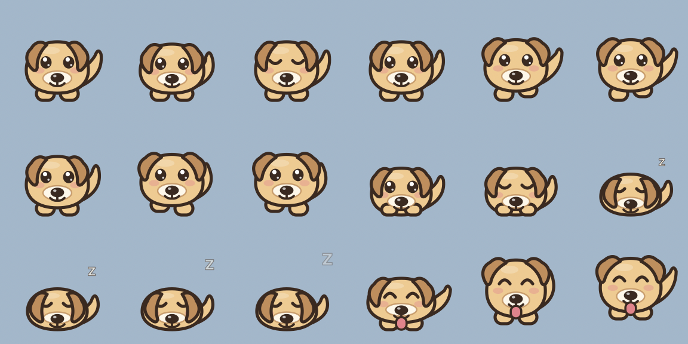

# Puplet

A pup-sized AI pet that lives on your macOS desktop. Native Swift + AppKit + SpriteKit, no
dependencies, no permission prompts.


All five states ([`docs/poses.png`](docs/poses.png) - idle, walk, sit, sleep, excited):



## Run it

Requires macOS 14+ and Xcode command line tools. Chat wants the
[Claude Code CLI](https://claude.com/claude-code) installed and logged in; the
on-device brain wants macOS 26 with Apple Intelligence enabled. Both optional -
the pup degrades gracefully to canned lines.

```sh
make run        # builds build/Puplet.app and (re)launches it
```

It launches as a menu-bar agent - look for the paw icon. No Dock icon, no window
list entry. Quit from the paw menu (or right-click the pup).

For a fast iteration loop during development (`make help` lists everything):

```sh
make frames              # renders every animation pose to PNG, no app launch
make chat MSG="hi pup"   # exercises the chat-brain ladder in the terminal
swift run Puplet         # runs unbundled (Dock icon appears, LSUIElement needs the bundle)
```

`make frames` also writes `contact-sheet.png` - the fastest way to iterate on
the art without watching the pup walk around. `make chat` prints which brain
answered, so you can verify the Claude Code layer before trusting the menu.

## What it does

- Wanders along the bottom of your screen: idle / walk / sit / sleep / excited,
  driven by a weighted random state machine.
- Click it to boop it. Drag it anywhere and it falls back down with a small bounce.
- Speaks in a click-through speech bubble that tracks it.
- Reacts to which app you switch to (`Xcode again?`), and to the time of day.
- **Talk to it.** Double-click the pup (or "Talk to Pip…" in the menu) and a
  small Spotlight-style input floats up beside it - no dialog, no app
  activation. Replies are full Claude, running on your existing Claude
  subscription through the local Claude Code CLI - no API key, no separate
  billing - and they **stream word by word into the speech bubble**. Falls back
  to the on-device model, then canned lines, so it always answers.
- **It remembers you.** Chat facts ("my name is…", "i love coffee") land in a
  local `memory.json` that every brain reads on every call - the pup knows you
  across launches. Wipe it any time with "Forget Memories".
- **Has a name.** Rename it from the menu; it reacts to the new name and
  remembers it across launches. The name is also injected into every brain's
  persona, so a named pet refers to itself correctly.

Menu (paw icon or right-click the pup): the pet's name · Talk to it · Say
Something · Come Here · Pause Wandering · Rename… · Forget Memories · brain and
chat status · Quit.

## Layout

| File | Role |
|---|---|
| `PetPanel.swift` | The `NSPanel` recipe - borderless, non-activating, floats over full-screen Spaces |
| `PetController.swift` | Owns the pet: window position, physics, drag, mouse gating, banter triggers |
| `Creature.swift` | Draws the pup procedurally, one `Pose` per animation frame |
| `PetScene.swift` | SpriteKit scene; builds the per-state animation loops |
| `Behavior.swift` | Weighted random state machine |
| `Brain.swift` | `PetBrain` protocol, shared persona, canned banter, on-device model, layered fallback |
| `ClaudeCodeBrain.swift` | Chat via the local Claude Code CLI in headless mode - rides your Claude subscription |
| `Memory.swift` | Long-term memory: a small JSON fact file shared by every brain |
| `SpeechBubble.swift` | Click-through bubble window |
| `Settings.swift` | `UserDefaults`-backed pet name + the rename prompt |
| `WorkspaceContext.swift` | Zero-permission context: frontmost app, time of day |
| `FrameDumper.swift` | `--dump-frames` art iteration helper |
| `GifDumper.swift` | `--dump-gif` renders the README demo animation |

## Design decisions worth keeping

**One small window per pet, sized to the sprite.** Not a full-screen transparent
overlay. The window is *moved* to walk the pup around. This means there is no
click-through problem to solve inside the sprite's own window, and it sidesteps
the hit-testing regressions that have repeatedly hit full-screen transparent
overlays on recent macOS. Alpha-based click-through is unreliable - don't build
on it.

**The window is click-through except over the pup.** `PetController.interactiveCore`
is the box where clicks count; outside it the panel sets `ignoresMouseEvents = true`
so the pup doesn't punch a 96×96 hole in your desktop. This is done by polling
`NSEvent.mouseLocation` once per frame rather than with a global event monitor -
polling can't get stuck in the "inside" state when the panel stops receiving
events, and it needs no permissions.

**The pet is pinned to one display.** Choosing the screen by the pet's center
teleports it across shared display edges: adjacent screens can have very
different `visibleFrame` origins (a portrait display beside a landscape one can
start at `minY = -252`), so the clamp yanks the pet to a new ground and X range
in one frame. "Come Here" and dragging are how it changes screens.

**The brain never drives the body directly.** It returns a line and a mood; the
state machine decides what that looks like. Animation stays smooth while
generation is slow, unavailable, or refused.

**Zero TCC permissions.** `WorkspaceContext` uses only `NSWorkspace`
notifications. Window titles would need Accessibility and pixels would need
Screen Recording - both deliberately absent, so the app installs clean.

## The brain

Two ladders, both ending in canned lines so the pet always has words and the
animation never blocks:

- **Ambient banter** (taps, app switches, idle thoughts): Apple's on-device
  model when Apple Intelligence is on, canned lines otherwise. Free either way -
  spontaneous chatter should never cost anything.
- **Chat** ("Talk to Pip…"): Claude Code on your subscription → on-device →
  canned shrug.

The paw menu shows which layer is live for each (`Brain: …` / `Chat: …`).

### Chatting on your Claude subscription

`ClaudeCodeBrain` shells out to `claude -p --output-format json` through a login
shell (an app launched from Finder inherits almost no PATH). Guardrails on every
call:

- `--tools ""` - the whole built-in toolset is disabled; the pet can never read
  files or run commands.
- `--system-prompt` - replaces the coding-agent preamble with the pet persona
  plus everything it remembers about you. Deliberately **not** `--bare`, which
  would skip the keychain OAuth this brain exists to use.
- `--resume <session-id>` - one continuous conversation per app run.
- The working directory is `~/Library/Application Support/Puplet`, so no real
  project gets indexed and pet sessions stay out of your project history.

The reply is a JSON contract - `{"say": …, "mood": …, "remember": …}`. `mood`
nudges the animation through the existing state machine, `remember` appends to
`memory.json`. Replies time out at 75 s, and after two consecutive failures the
brain reports itself as failing and chat falls through to the next layer, so a
logged-out CLI degrades gracefully instead of hanging every message.

Chat streams: the call runs `--output-format stream-json --include-partial-messages`
(`--verbose` is mandatory with stream-json in print mode), and the growing
`say` value is extracted incrementally from the accumulating text deltas - the
bubble types words, never JSON skeleton. Thinking deltas are ignored, so the
"…" bubble naturally persists while the model thinks. The final `result`
envelope is parsed exactly like the non-streaming path, which also remains as
the fallback contract.

Chat uses your Claude Code default model and effort. Override either (values
pass straight through to `--model` / `--effort`):

```sh
defaults write dev.dilee.puplet chatModel sonnet   # any --model value: haiku, opus, a full model id…
defaults write dev.dilee.puplet chatEffort low     # low | medium | high | xhigh | max
defaults delete dev.dilee.puplet chatModel         # back to your Claude Code default
```

Both are read per-message, so changes apply to the next thing you say - no
relaunch. `sonnet` + `low` makes a snappy pet that barely dents the allowance;
unset, a thinking default model can take a while (the pup sits patiently).

Usage counts against your subscription's allowance - chat is user-initiated
only, ambient banter never touches it. If you ever distribute the app, each
user brings their own `claude` login, or you swap in a Messages API `PetBrain`
with an API key.

**If Apple Intelligence is off**, ambient banter runs on canned lines. Turn it
on in System Settings to get `FoundationModelsBrain` - free, offline, no API
key. It's gated three ways: build guard (`#if canImport`), OS version
(`@available(macOS 26.0, *)`), and runtime
(`SystemLanguageModel.default.availability`).

Notes if you extend it:

- `PetUtterance` / `PetChatUtterance` are `@Generable`, so the model returns a
  typed `{utterance, mood}` struct rather than text you have to parse.
- Ambient banter uses a fresh `LanguageModelSession` per utterance to stay far
  from the 4k-token per-session context limit. Chat keeps one session per app
  run (with a `remember` tool attached) and rebuilds it on any error, which also
  covers blowing past that limit mid-conversation.
- Guardrail rejections are normal and land in the `catch` - that's why the canned
  layer exists.

To use a metered cloud model instead of the subscription route, write another
`ChatBrain` against the Messages API and put it ahead of the others in
`LayeredBrain`. Keep idle chatter on the cheap layers: pre-generate banter in
batches and sample locally, and reserve API calls for user-initiated exchanges.
Anthropic prompt caching needs a 4,096-token minimum prefix on Haiku - a short
persona prompt silently won't cache.

## Next steps

- **Better art.** Replace `Creature.swift` with a sprite-sheet loader
  (`SKTextureAtlas` + `SKAction.animate`) and keep the `Pose`-per-frame idea.
  Aseprite for authoring. If you want authored state machines with blended
  transitions, Rive's `RiveRuntime` is the natural upgrade - but verify it
  renders inside a transparent borderless window before committing, that
  combination is unverified.
- **Voice.** `AVSpeechSynthesizer` piped through `AVAudioUnitTimePitch` gets a
  creature voice for free and offline. Kokoro-82M via sherpa-onnx when it matters.
- **More context.** Accessibility (window titles) and ScreenCaptureKit (pixels)
  as opt-in settings, never on by default.
- **More persistence.** The name lives in `UserDefaults` via `PetSettings` and
  memories in `~/Library/Application Support/Puplet/memory.json`; last position,
  palette, and `isWanderingPaused` are the obvious next keys.

## Distribution

`bundle.sh` ad-hoc signs, which is fine locally. To ship to anyone else you need
a Developer ID, hardened runtime, `xcrun notarytool submit --wait`, and
`xcrun stapler staple` - since Sequoia removed the Control-click Gatekeeper
bypass, unnotarized apps just look broken. The overlay recipe here is
sandbox-safe, but the Mac App Store has no precedent for a screen-roaming pet
window, so budget for review friction if that's the goal.

## License

[Apache 2.0](LICENSE).
